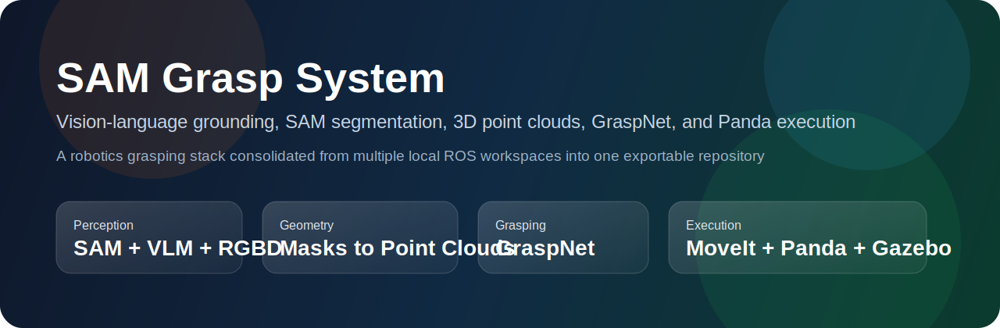
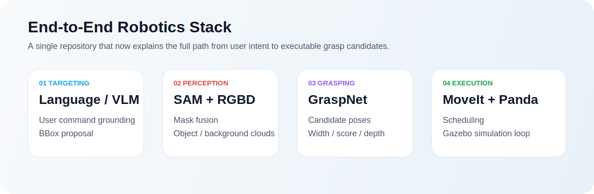
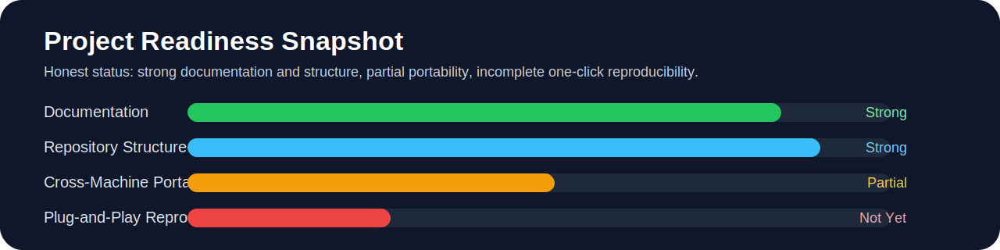
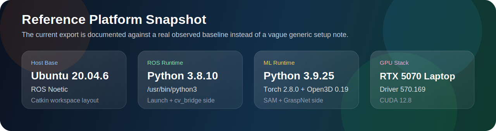

<p align="center">
  
</p>

<p align="center">
  
  
  
  
  
  
  
  
  
</p>

# SAM Grasp System

一个面向机器人抓取研究的 ROS1 集成工程，围绕以下能力构建：

- 自然语言或视觉目标选择
- SAM 图像分割与目标点云生成
- GraspNet 抓取位姿生成
- Panda + MoveIt + Gazebo 联动执行
- 手腕相机 VLM 辅助二次感知

这个仓库不是简单的单包备份，而是把原本分散在多个本地工作区中的关键组件汇总成一个可审阅、可移植、可继续工程化的版本。

<p align="center">
  
</p>

> **当前结论**
>
> 这个项目 **还不能被定义为“在任何其他电脑上下载后直接运行”**。
>
> 它已经达到了“结构完整、依赖链清晰、具备复现实验基础”的阶段，但距离“开箱即用”还差几个关键条件：
>
> 1. 目标机器需要提前具备 ROS / Gazebo / MoveIt / Franka 生态依赖。
> 2. `sam_vit_b_01ec64.pth` 没有随仓库提供，需要用户自行放置。
> 3. 仓库现在已经补上参考环境、兼容性矩阵和轻量 CI，但还没有做到 Docker / 一键安装。
> 4. 还没有一份“干净机器从 `clone` 到 `roslaunch` 全链路成功”的正式验收记录。

<p align="center">
  
</p>

<p align="center">
  
</p>

## 目录

- [项目定位](#项目定位)
- [项目亮点](#项目亮点)
- [系统总览](#系统总览)
- [仓库结构](#仓库结构)
- [参考平台](#参考平台)
- [当前可移植性结论](#当前可移植性结论)
- [快速开始](#快速开始)
- [文档导航](#文档导航)
- [项目现状与下一步](#项目现状与下一步)

## 项目定位

这个工程更接近一个 **研究型机器人抓取系统集成仓库**，而不是单一算法仓库。它把以下几类技术连在了一起：

- 感知层：RGB、Depth、CameraInfo、Wrist Camera
- 视觉模型层：SAM、VLM、YOLOv5、GraspNet
- 中间表示层：2D BBox、Mask、3D Point Cloud、Candidate Grasps
- 机器人执行层：MoveIt、Franka Panda、Gazebo、调度器

从工程角度看，它最有价值的地方不是某一个脚本，而是这条完整的数据链路已经被实际串起来了。

## 项目亮点

<table>
  <tr>
    <td width="33%">
      <strong>完整链路</strong><br/>
      从自然语言 / VLM 选目标，一直串到 SAM、点云、GraspNet、MoveIt 和 Panda 执行。
    </td>
    <td width="33%">
      <strong>多包整合</strong><br/>
      把原本散落在多个本地工作区中的包合并成一个更容易审阅和交付的仓库。
    </td>
    <td width="33%">
      <strong>诚实文档</strong><br/>
      README 和审查文档明确区分了“已经具备的能力”和“尚未工程化完成的部分”。
    </td>
  </tr>
  <tr>
    <td width="33%">
      <strong>图文化表达</strong><br/>
      提供横幅、架构图、状态图和分层文档，首页阅读体验更接近成熟开源项目。
    </td>
    <td width="33%">
      <strong>可继续工程化</strong><br/>
      已经为后续 Docker、CI、环境锁定和 clean-machine 验收留出了清晰入口。
    </td>
    <td width="33%">
      <strong>研究价值高</strong><br/>
      这是一个真实机器人抓取系统的集成快照，而不是只停留在算法 demo 的单脚本工程。
    </td>
  </tr>
</table>

## 系统总览

```mermaid
flowchart LR
    A[User Command / Scene Goal] --> B[VLM Planner]
    B --> C[/sam/prompt_bbox]
    D[RGB + Depth + CameraInfo] --> E[SAM Perception Node]
    C --> E
    E --> F[/sam_perception/object_cloud]
    E --> G[/sam_perception/background_cloud]
    F --> H[GraspNet Inference]
    H --> I[/graspnet/grasp_pose_array_raw]
    H --> J[/graspnet/grasp_info_raw]
    I --> K[MoveIt / Panda Scheduler]
    J --> K
    L[Wrist Camera] --> M[Wrist VLM Node]
    M --> N[/wrist_vlm/bbox]
```

### 核心包职责

| Package | Responsibility | Status |
| --- | --- | --- |
| `sam_perception` | SAM 分割、LLM/VLM 框选、前景/背景点云、GraspNet 对接 | Core |
| `panda_moveit_config` | Panda + MoveIt 配置与 Gazebo 启动链 | Core |
| `panda_pick_place` | Panda 抓取执行、调度、世界文件 | Core |
| `third_party/graspnet-baseline` | GraspNet 本地推理代码与 checkpoint | Core |
| `yolov5_ros` | YOLOv5 ROS 检测链，部分仿真流程使用 | Optional / Included |
| `grasp_detector_ros` | 历史抓取检测链路，部分 launch 使用 | Optional / Included |
| `detection_msgs` | 检测消息定义 | Optional / Included |

## 仓库结构

```text
sam-panda-grasp-system/
├── src/
│   ├── CMakeLists.txt
│   ├── sam_perception/
│   ├── panda_moveit_config/
│   ├── panda_pick_place/
│   ├── yolov5_ros/
│   ├── grasp_detector_ros/
│   └── detection_msgs/
├── third_party/
│   └── graspnet-baseline/
├── docs/
│   ├── ARCHITECTURE.md
│   ├── COMPATIBILITY.md
│   ├── PORTABILITY_AUDIT.md
│   ├── QUICKSTART.md
│   └── assets/
├── environment/
│   ├── README.md
│   └── anygrasp_env.reference.yml
├── requirements/
│   └── anygrasp-reference.txt
└── scripts/
    └── check_export_env.sh
```

## 参考平台

这个仓库现在带有一套**真实提取自原始工作环境**的参考基线，用来帮助别人理解“至少什么组合更接近可运行状态”。

| Layer | Reference Baseline |
| --- | --- |
| Host OS | Ubuntu 20.04.6 LTS |
| ROS Distro | Noetic |
| ROS Runtime Python | `/usr/bin/python3` = Python 3.8.10 |
| ML Runtime Python | `anygrasp_env` = Python 3.9.25 |
| GPU | NVIDIA GeForce RTX 5070 Laptop GPU |
| Driver / CUDA | 570.169 / CUDA 12.8 |
| Key ML Packages | `torch 2.8.0+cu128`, `open3d 0.19.0`, `opencv-python 4.11.0.86`, `openai 2.26.0`, `segment-anything 1.0` |

这不是一个“严格锁死的唯一组合”，但它比抽象地写“需要 Python 3”更接近真实可复现路径。详细说明请看 [COMPATIBILITY.md](docs/COMPATIBILITY.md) 和 [environment/README.md](environment/README.md)。

## 当前可移植性结论

### 结论一句话

**不是完全开箱即用，但已经接近“可复现的研究工程版本”。**

### 已经解决的问题

- 原始本地工程里的明文 API Key 已移除，改为环境变量驱动。
- `sam_perception` 的 Python 包导出问题已修正。
- `GraspNet` 路径支持仓库内相对路径，也支持外部覆盖。
- 多个核心 launch 中的本机 Python 绝对路径已经改为环境变量覆盖。
- 缺失的相关 ROS 包已经补入当前导出仓库。
- 参考环境文件、兼容性矩阵、贡献说明和轻量 CI 已加入仓库。
- `supermarket.world` 已移除机器本地 `Cracker_Box` 网格依赖，导出版本改为自包含占位几何体。

### 仍然阻塞“别的电脑一下载就跑”的问题

| Issue | Impact | Severity |
| --- | --- | --- |
| SAM 权重未随仓库提供 | 感知节点无法直接启动 | Blocking |
| ROS / Gazebo / MoveIt / Franka 依赖未一键安装 | 新机器仍需人工准备基础环境 | Blocking |
| Torch / CUDA / Open3D / `cv_bridge` 的双解释器组合未完全锁定 | 运行期导入或 ABI 失配风险 | High |
| 没有干净机器上的端到端验收记录 | 无法诚实证明仓库即开即用 | High |
| 当前 `Cracker_Box` 采用占位几何体而非原始贴图模型 | 仿真视觉 fidelity 与原始本机场景不完全一致 | Medium |

更详细的角色化评审请看 [PORTABILITY_AUDIT.md](docs/PORTABILITY_AUDIT.md)。

## 快速开始

完整步骤见 [QUICKSTART.md](docs/QUICKSTART.md)。如果你想先做最小验证，建议按下面顺序：

### 1. 做环境自检

```bash
cd /path/to/sam-panda-grasp-system
bash scripts/check_export_env.sh
export DASHSCOPE_API_KEY=your_key
export ANYGRASP_PYTHON=/path/to/your/conda/env/bin/python
```

### 参考启动方式

推荐将系统分为两部分启动：

1. 启动 Gazebo / MoveIt / SAM / GraspNet 感知链：

```bash
roslaunch sam_perception system_new.launch launch_demo:=false
```

2. 启动执行 / 调度 / 手腕 VLM：

```bash
roslaunch sam_perception demo_only.launch
```

如果希望一次性启动完整系统，也可以直接：

```bash
roslaunch sam_perception system_new.launch launch_demo:=true
```

### 2. 准备关键环境变量

```bash
export ANYGRASP_PYTHON=/path/to/your/python
export ROS_PYTHON_EXEC=/usr/bin/python3
export DASHSCOPE_API_KEY=your_key
export SAM_CHECKPOINT_PATH=/absolute/path/to/sam_vit_b_01ec64.pth
```

如果你的环境需要显式设置 `libffi` 预加载：

```bash
export LIBFFI_PRELOAD=/usr/lib/x86_64-linux-gnu/libffi.so.7
```

如果你想尽量贴近原始工作环境，先看：

- [environment/README.md](environment/README.md)
- [environment/anygrasp_env.reference.yml](environment/anygrasp_env.reference.yml)
- [requirements/anygrasp-reference.txt](requirements/anygrasp-reference.txt)

### 3. 构建工作区

```bash
catkin_make
source devel/setup.bash
```

### 4. 先从最小链路启动

仅启动感知主链：

```bash
roslaunch sam_perception sam_py.launch
roslaunch sam_perception run_graspnet.launch
```

完整联动系统：

```bash
roslaunch sam_perception system_new.launch
```

## 文档导航

- [系统架构详解](docs/ARCHITECTURE.md)
- [兼容性矩阵与参考平台](docs/COMPATIBILITY.md)
- [跨机器可移植性审查](docs/PORTABILITY_AUDIT.md)
- [快速开始与环境准备](docs/QUICKSTART.md)
- [参考环境重建说明](environment/README.md)
- [第三方组件与来源说明](docs/THIRD_PARTY.md)
- [贡献与改动建议](CONTRIBUTING.md)

## 项目现状与下一步

如果要把这个仓库提升到真正“顶级项目”的交付标准，推荐优先做下面四件事：

1. 提供 Docker / Dev Container / `rosdep` 自动化，减少人工安装 ROS 生态依赖。
2. 补齐 SAM 权重获取流程，并给出更明确的模型文件管理策略。
3. 在干净机器上跑一次从 `clone` 到 `roslaunch` 的完整验收，并把结果固化成 smoke test。
4. 明确所有子包的许可证与来源，补齐 `LICENSE`、`NOTICE` 和依赖清单。

---

如果你是第一次接触这个仓库，建议按这个阅读顺序：

1. 先看 [ARCHITECTURE.md](docs/ARCHITECTURE.md)
2. 再看 [QUICKSTART.md](docs/QUICKSTART.md)
3. 再看 [PORTABILITY_AUDIT.md](docs/PORTABILITY_AUDIT.md)
4. 最后看 [THIRD_PARTY.md](docs/THIRD_PARTY.md)
