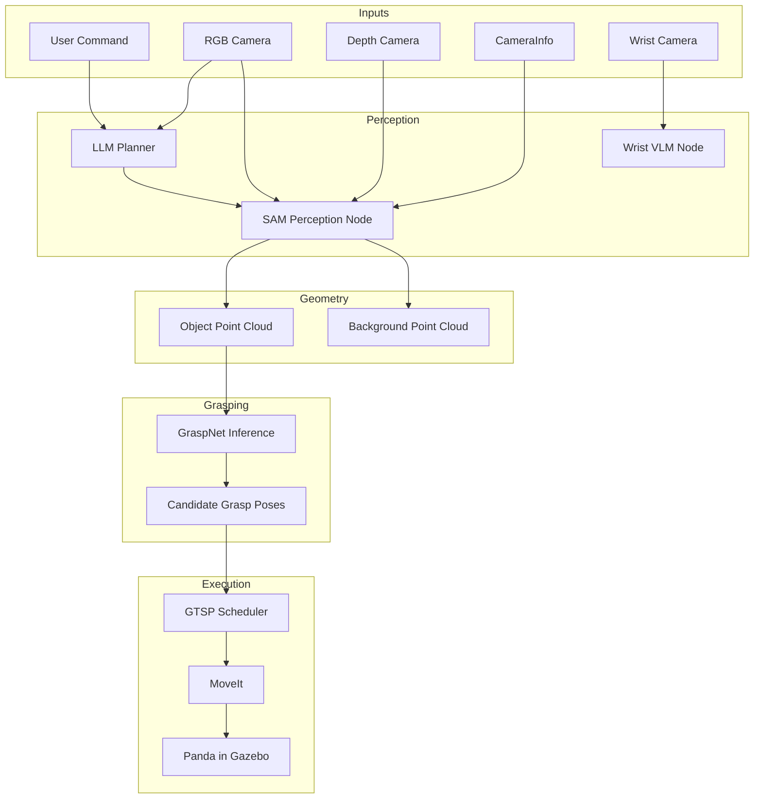
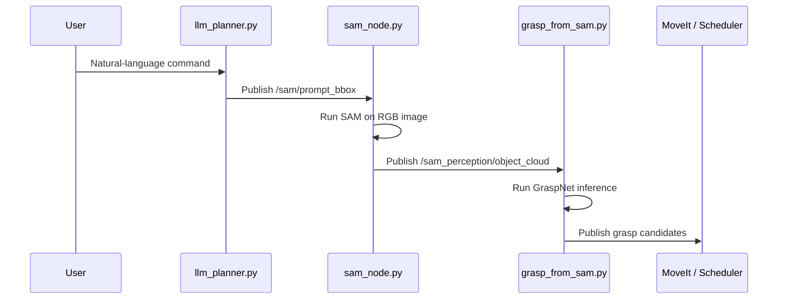
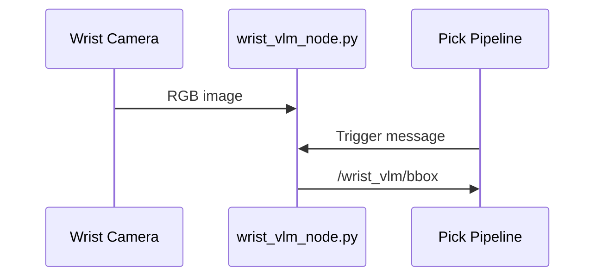

# Architecture

## 1. System View

## 2. Main Runtime Chains

### Chain A: Command -> Segmentation -> Grasp

### Chain B: Wrist Recheck

## 3. Key ROS Topics

| Topic | Publisher | Consumer | Meaning |
| --- | --- | --- | --- |
| `/camera/color/image_raw` | RGB camera | `sam_node.py`, `llm_planner.py`, `yolov5_ros` | Main color stream |
| `/camera/depth/image_raw` | Depth camera | `sam_node.py` | Depth stream for 3D reconstruction |
| `/camera/color/camera_info` | Camera driver | `sam_node.py` | Intrinsics |
| `/sam/prompt_bbox` | `llm_planner.py` | `sam_node.py` | Target bounding boxes |
| `/sam_perception/object_cloud` | `sam_node.py` | `grasp_from_sam.py` | Foreground object cloud |
| `/sam_perception/background_cloud` | `sam_node.py` | downstream debug / environment logic | Background cloud |
| `/graspnet/grasp_pose_array_raw` | `grasp_from_sam.py` | scheduler / planner | Candidate grasp poses |
| `/graspnet/grasp_info_raw` | `grasp_from_sam.py` | scheduler / planner | Width, score, depth triplets |
| `/wrist_camera/color/image_raw` | Wrist camera | `wrist_vlm_node.py` | Wrist re-observation |
| `/wrist_vlm/trigger` | pick pipeline | `wrist_vlm_node.py` | Trigger VLM re-detection |
| `/wrist_vlm/bbox` | `wrist_vlm_node.py` | pick pipeline | Wrist-stage target box |

## 4. Package Layout

### `src/sam_perception`

- `scripts/sam_node.py`: SAM segmentation, mask fusion, point-cloud generation.
- `scripts/grasp_from_sam.py`: GraspNet inference from segmented object cloud.
- `scripts/llm_planner.py`: VLM-assisted bbox generation from user command.
- `scripts/wrist_vlm_node.py`: Wrist-camera target re-localization.
- `launch/*.launch`: Runtime entry points.

### `src/panda_pick_place`

- Gazebo worlds and object models.
- Demo scripts and scheduler.
- Panda-side runtime logic for pick and place.

### `src/panda_moveit_config`

- MoveIt launch chain.
- Panda planning config.
- Gazebo bridge and controller configuration.

### `third_party/graspnet-baseline`

- Local GraspNet inference code.
- `checkpoint-rs.tar` included in this export.

## 5. Launch Entry Points

| Launch file | Purpose | Recommended use |
| --- | --- | --- |
| `sam_perception/sam_py.launch` | Start SAM segmentation node only | Validate perception |
| `sam_perception/run_graspnet.launch` | Start GraspNet node only | Validate point-cloud -> grasp inference |
| `sam_perception/llm.launch` | Start VLM command planner | Validate text/image grounding |
| `sam_perception/system_new.launch` | Full integrated system | Main end-to-end launch |
| `panda_pick_place/supermarket_sim.launch` | Legacy YOLO + grasp detector simulation flow | Optional / historical |

## 6. Architecture Risks

### Good news

- The core perception-to-grasp chain is conceptually clean.
- Major modules are separated by ROS topics.
- The export now groups previously scattered workspaces into one repo.

### Current engineering debt

- Some integrated flows still depend on external ROS ecosystems not vendored here.
- World assets are not fully self-contained.
- Runtime behavior still depends on Python environment compatibility.
- Some packages remain research-grade and rely on manual operator knowledge.
