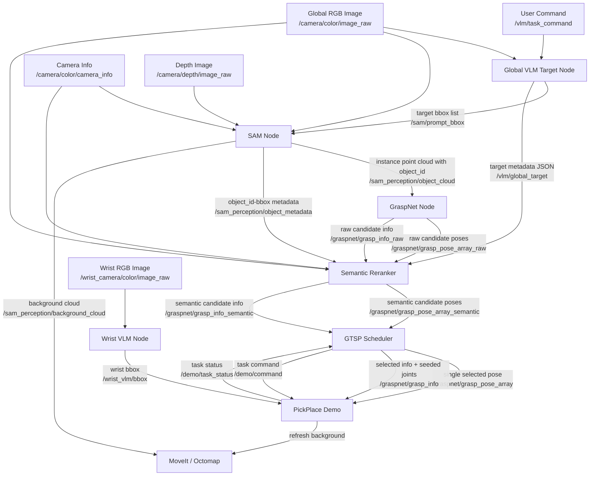
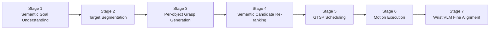

# Semantic VLM Pipeline

## 1. Overall Flow



## 2. Runtime Stages



## 3. Node-by-Node Breakdown

| Node | File | Inputs | Outputs | Main Algorithm / Role |
|---|---|---|---|---|
| `global_vlm_target_node` | `src/sam_perception/scripts/global_vlm_target_node.py` | `/vlm/task_command`, `/camera/color/image_raw` | `/sam/prompt_bbox`, `/vlm/global_target` | Vision-language grounding. It parses the user command, finds matching shelf items, and returns structured JSON with `target`, `bboxes`, and `confidence`. |
| `sam_perception_node` | `src/sam_perception/scripts/sam_node.py` | `/sam/prompt_bbox`, RGB, depth, camera intrinsics | `/sam_perception/object_cloud`, `/sam_perception/background_cloud`, `/sam_perception/object_metadata` | SAM-based instance segmentation. It converts VLM bboxes into masks, extracts per-instance 3D point clouds, assigns `object_id`, and explicitly publishes the retained `object_id -> bbox` mapping. |
| `grasp_from_sam` | `src/sam_perception/scripts/grasp_from_sam.py` | `/sam_perception/object_cloud`, RGB, camera intrinsics | `/graspnet/grasp_pose_array_raw`, `/graspnet/grasp_info_raw` | Per-object GraspNet inference. Each object cloud is processed separately to generate grasp candidates. Scores are corrected with an approach offset and a center penalty. |
| `semantic_reranker` | `src/sam_perception/scripts/semantic_reranker.py` | Raw grasp candidates, `/vlm/global_target`, RGB, camera intrinsics | `/graspnet/grasp_pose_array_semantic`, `/graspnet/grasp_info_semantic`, `/vlm/semantic_rerank` | VLM-based semantic comparison. It projects candidate grasps to image space, asks VLM which candidates better satisfy the task, and attaches a `semantic_score` to each candidate. |
| `gtsp_scheduler_node` | `src/panda_pick_place/scripts/gtsp_scheduler.py` | Semantic grasp candidates | `/graspnet/grasp_pose_array`, `/graspnet/grasp_info`, `/demo/command` | GTSP-style scheduling in configuration space. It groups grasps by `object_id`, runs IK feasibility filtering, and uses a genetic algorithm to minimize joint transition cost. The new version can discount cost using `semantic_score`. |
| `pick_place_service` | `src/panda_pick_place/scripts/demo.py` | Selected grasp pose/info, wrist bbox, depth, TF, MoveIt services | `/demo/task_status` | Motion execution. It plans to an observation pose, performs wrist-camera-based fine alignment, inserts, closes the gripper, retracts, and places into the basket. |
| `wrist_vlm_node` | `src/sam_perception/scripts/wrist_vlm_node.py` | `/wrist_vlm/trigger`, `/wrist_camera/color/image_raw` | `/wrist_vlm/bbox` | Local eye-in-hand grounding. It finds the target object in the wrist image and provides a bbox for final alignment. |

## 4. What Each Stage Uses

### Stage 1: Semantic goal understanding
- Input: user command such as `"抓最右边那罐可乐"` and the global shelf RGB image.
- Output: target description, confidence, and one or more target bboxes.
- Algorithm: VLM zero-shot vision-language grounding via `qwen-vl-max`.

### Stage 2: Target segmentation
- Input: target bboxes from the global VLM and the RGB-D frame.
- Output: object masks and a merged point cloud with per-point `object_id`.
- Algorithm: SAM segmentation guided by bbox prompt, then depth lifting to 3D.

### Stage 3: Per-object grasp generation
- Input: instance point cloud for each `object_id`.
- Output: multiple 6-DoF grasp candidates with width, score, and depth.
- Algorithm: GraspNet forward inference on each object cloud separately.

### Stage 4: Semantic candidate re-ranking
- Input: top grasp candidates for each object, target metadata, global RGB image.
- Output: reordered candidates plus `semantic_score`.
- Algorithm:
  - project candidate grasp centers and approach direction onto the RGB image
  - crop the target region
  - ask VLM to compare candidates
  - produce `best_index`, `semantic_scores`, `preferred_region`, `avoid_region`, `grasp_side`

### Stage 5: GTSP scheduling
- Input: per-object candidate set after semantic reranking.
- Output: a single next grasp pose plus seeded joint configuration.
- Algorithm:
  - group by `object_id`
  - run IK filtering
  - optimize the visiting order with a genetic algorithm
  - transition cost is now:

```text
effective_cost = joint_cost / (1 + semantic_weight * semantic_score)
```

### Stage 6: Motion execution
- Input: selected grasp pose and candidate metadata.
- Output: actual pick-and-place execution and success/failure status.
- Algorithm:
  - MoveIt planning to observation pose
  - collision-aware pre-grasp
  - cartesian insertion and retreat
  - basket placement

### Stage 7: Wrist VLM fine alignment
- Input: wrist RGB-D image near the target.
- Output: wrist bbox and a world-frame correction vector.
- Algorithm:
  - VLM returns a wrist bbox
  - depth banding extracts the visible front surface
  - TF transforms camera-frame offset into world-frame correction

## 5. Key Topics

| Topic | Meaning |
|---|---|
| `/vlm/task_command` | User semantic task input |
| `/vlm/global_target` | Structured target understanding result |
| `/sam/prompt_bbox` | Global VLM to SAM spatial prompt |
| `/sam_perception/object_cloud` | Segmented object cloud with `object_id` |
| `/sam_perception/object_metadata` | Explicit mapping between retained `object_id` and original / final bbox |
| `/graspnet/grasp_pose_array_raw` | Raw grasp candidates from GraspNet |
| `/graspnet/grasp_info_raw` | Raw candidate metadata: `object_id, width, score, depth` |
| `/graspnet/grasp_pose_array_semantic` | Candidates after semantic reranking |
| `/graspnet/grasp_info_semantic` | Candidate metadata with appended `semantic_score` |
| `/graspnet/grasp_pose_array` | Final pose sent to executor |
| `/graspnet/grasp_info` | Final selected metadata + seeded joints |
| `/wrist_vlm/bbox` | Wrist-camera local target bbox |
| `/demo/task_status` | Task result feedback for scheduler |

## 6. Current Interpretation

This pipeline is no longer just:

```text
perceive object -> generate grasp -> minimize motion cost -> execute
```

It has become:

```text
understand semantic target -> segment target -> generate grasp candidates
-> semantically compare candidates -> schedule with semantic preference
-> execute -> locally verify and refine
```

So the system has moved from a purely geometric picking pipeline to a semantic-conditioned shelf picking pipeline.
